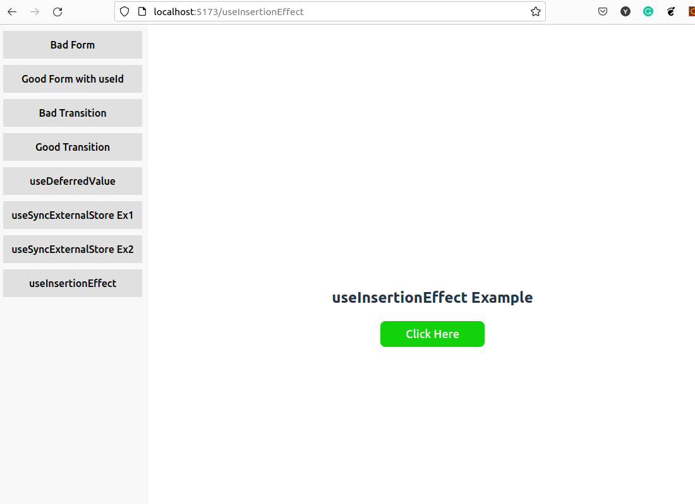

# React 18 New Hooks

This is a sample React project that demonstrates the usage of React 18 Hooks.



## Getting Started

1. Clone the repository to your local machine:

   ```bash
   git clone https://github.com/Yasas4D/react-new-hooks.git
   ```

2. Change to the project directory:

   ```bash
   cd react-18-hooks-example
   ```

3. Install the dependencies using yarn:
   ```bash
   yarn install
   ```
4. Start the development server:
   ```bash
   yarn dev
   ```
5. Open your web browser and navigate to http://localhost:5173 to see the React 18 Hooks example in action.
